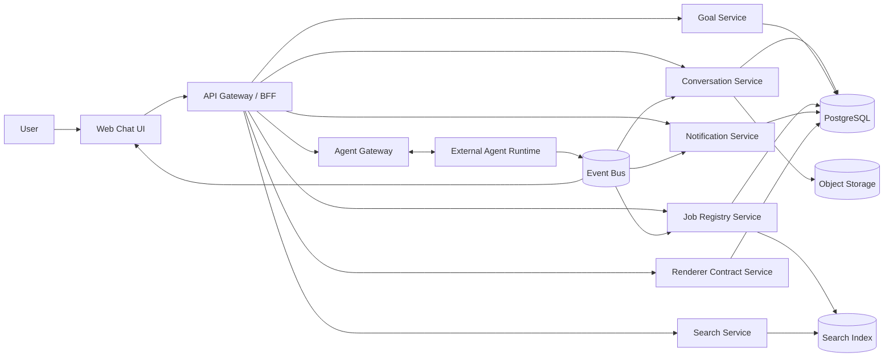

# Pluggable Chat Frontier for Agentic Systems

## 1. Purpose

This document defines a high level architecture for a **pluggable chat system** that acts as the interaction frontier for an external AI agent platform.

The chat system is **not** responsible for agent reasoning, planning, tool execution, or business workflows. Its job is to provide a robust, extensible, and observable way for users to:

- chat with the agentic system
- set and manage goals
- receive notifications and follow up on them
- track jobs and task state
- search historical jobs and outputs
- provide structured input through forms and uploads
- view charts, reports, and tables

The key design goal is to keep the system **completely pluggable** so that agent runtimes, renderers, notification providers, storage layers, and search backends can evolve independently.

---

## 2. Design principles

### 2.1 Strict separation of concerns
The chat system owns interaction, orchestration visibility, and rendering. The agent platform owns reasoning and execution.

### 2.2 Headless core, pluggable UI
Core capabilities should be modeled as APIs and contracts first. UI becomes a renderer of structured state, not the source of truth.

### 2.3 Structured payloads over arbitrary UI
Agents should never return raw HTML or frontend code. They should return validated, typed payloads such as text, table, chart, form request, file reference, progress card, or notification.

### 2.4 Jobs and artifacts as first class entities
Chat history alone is not enough. Users need to search and revisit jobs, reports, generated documents, inputs, and outcomes.

### 2.5 Event driven from day one
This system needs real time updates for streaming, job progress, completion notifications, and requests for user input.

### 2.6 Versioned contracts
All message types, form schemas, chart specs, and plugin contracts must be versioned to avoid future breakage.

---

## 3. Scope

### In scope
- text chat interface for agent interaction
- goal management
- background job visibility
- time based and event based notifications
- searchable jobs and artifacts
- dynamic forms and file uploads
- charts and tabular renderers
- plugin model for adapters and renderers

### Out of scope
- agent reasoning engine
- tool execution implementation
- workflow logic for domain tasks
- LLM provider logic
- business specific report generation

---

## 4. Functional requirements mapping

### 4.1 Text chat
Users can converse with the external agentic system in a conversation thread.

### 4.2 Goal setting
Users can define or update a goal for the current conversation or workspace.

### 4.3 Notifications
Users receive notifications in the chat UI when:
- a scheduled job starts or completes
- a background result becomes available
- the system needs additional input
- a job fails
- an artifact is ready

### 4.4 Task center
Users can inspect jobs by state:
- scheduled
- queued
- running
- waiting for input
- failed
- completed
- archived

### 4.5 Search
Users can search for jobs, outputs, reports, and prior requests.

### 4.6 Dynamic forms
The system can ask for structured input at runtime using schema driven forms. Inputs may include text, dates, files, and images.

### 4.7 Graphs and charts
The system can render visual summaries and progress views from structured chart specs.

### 4.8 Table rendering
The system can render reports and result sets as tables with sorting, filtering, pagination, and export.

---

## 5. High level architecture



### Explanation
- **Web Chat UI** renders conversations, forms, charts, tables, and notifications.
- **API Gateway / BFF** provides frontend friendly APIs and session aware aggregation.
- **Conversation Service** stores threads and messages.
- **Goal Service** stores goal state separate from free form chat.
- **Job Registry Service** tracks execution lifecycle and artifacts.
- **Notification Service** manages in app notifications and delivery channels.
- **Search Service** indexes conversations, jobs, and artifacts.
- **Renderer Contract Service** validates structured UI payloads.
- **Agent Gateway** is the only integration boundary with external agent systems.
- **Event Bus** propagates status changes, streaming events, and notifications.

---

## 6. Logical domains

## 6.1 Conversation domain
Handles the interaction timeline.

Core entities:
- conversation
- message
- participant
- attachment
- message event

## 6.2 Goal domain
Represents what the user wants to achieve.

Core entities:
- goal
- goal state
- goal constraints
- goal history

## 6.3 Job domain
Tracks work being scheduled or executed outside the chat system.

Core entities:
- job
- job state
- job progress
- retry
- failure summary
- execution reference

## 6.4 Artifact domain
Stores outputs produced by jobs.

Core entities:
- artifact
- artifact version
- artifact metadata
- artifact preview

## 6.5 Rendering domain
Defines safe structured content that can be shown in UI.

Supported content types:
- text
- markdown
- notification
- goal update card
- status card
- form request
- table
- chart
- file reference
- image reference
- action card
- error card

---

## 7. Architectural style

A modular monolith is a practical starting point if the team is small and expected scale is moderate. Each domain should still have strict internal boundaries and independent interfaces. If scale, team size, or reliability requirements grow, services can be extracted incrementally.

### Recommended initial shape
- frontend app
- backend for frontend
- modular backend with domain modules
- external event bus
- dedicated search index

This avoids premature microservice theater, which is often just distributed confusion with extra YAML.

---

## 8. Core contracts

## 8.1 Message envelope
Every conversation item should use a common envelope.

```json
{
  "id": "msg_123",
  "conversationId": "conv_1",
  "source": "agent",
  "type": "form_request",
  "version": "1.0",
  "createdAt": "2026-03-14T10:00:00Z",
  "payload": {}
}
```

### Message types
- `text`
- `notification`
- `goal_update`
- `job_status`
- `form_request`
- `table`
- `chart`
- `file`
- `image`
- `action_prompt`
- `error`
- `system_event`

## 8.2 Agent gateway contract
The chat system should call external agent systems only through adapters.

### Suggested operations
- `startTurn(conversationId, userInput, context)`
- `setGoal(conversationId, goal)`
- `submitForm(jobId, response)`
- `cancelJob(jobId)`
- `getJob(jobId)`
- `searchArtifacts(query, filters)`
- `subscribeEvents(sessionId)`

### Event types from agent system
- `turn.started`
- `turn.delta`
- `turn.completed`
- `job.created`
- `job.scheduled`
- `job.started`
- `job.progress`
- `job.waiting_for_input`
- `job.completed`
- `job.failed`
- `artifact.created`
- `notification.created`

## 8.3 Renderer contract
The renderer contract service validates all structured UI payloads.

### Example table payload
```json
{
  "type": "table",
  "version": "1.0",
  "payload": {
    "columns": [
      {"key": "employeeId", "label": "Employee ID"},
      {"key": "amount", "label": "Amount"}
    ],
    "rows": [
      {"employeeId": "E101", "amount": 20000}
    ],
    "capabilities": {
      "sort": true,
      "filter": true,
      "paginate": true,
      "export": ["csv", "xlsx"]
    }
  }
}
```

### Example chart payload
```json
{
  "type": "chart",
  "version": "1.0",
  "payload": {
    "kind": "line",
    "title": "Daily completions",
    "x": ["Mon", "Tue", "Wed"],
    "series": [
      {"name": "Completed", "data": [12, 20, 17]}
    ]
  }
}
```

### Example form request
```json
{
  "type": "form_request",
  "version": "1.0",
  "payload": {
    "schema": {
      "type": "object",
      "properties": {
        "employeeId": {"type": "string"},
        "month": {"type": "string", "format": "date"},
        "employeePhoto": {"type": "string", "contentMediaType": "image/*"}
      },
      "required": ["employeeId", "month"]
    },
    "uiSchema": {},
    "submitAction": "job.provideInput"
  }
}
```

---

## 9. Data model

## 9.1 Tables or collections

### conversations
- id
- title
- owner_user_id
- active_goal_id
- status
- created_at
- updated_at

### messages
- id
- conversation_id
- source_type
- type
- version
- payload_json
- correlation_id
- created_at

### goals
- id
- conversation_id
- title
- description
- status
- metadata_json
- created_at
- updated_at

### jobs
- id
- conversation_id
- goal_id
- external_job_ref
- job_type
- status
- priority
- schedule_at
- started_at
- completed_at
- progress_percent
- input_ref
- result_ref
- error_summary
- metadata_json
- created_at
- updated_at

### artifacts
- id
- job_id
- conversation_id
- artifact_type
- title
- storage_uri
- preview_json
- metadata_json
- created_at

### notifications
- id
- user_id
- conversation_id
- job_id
- type
- title
- body
- is_read
- created_at

### attachments
- id
- conversation_id
- message_id
- storage_key
- filename
- mime_type
- size_bytes
- metadata_json
- created_at

### plugin_registry
- id
- plugin_type
- plugin_name
- version
- status
- config_json
- created_at
- updated_at

---

## 10. Search design

Search should operate across multiple dimensions.

### Indexed sources
- conversation messages
- goals
- jobs
- artifacts
- attachments metadata
- tags and business identifiers

### Search capabilities
- full text search
- structured filters
- date range filters
- status filters
- artifact type filters
- saved searches

### Example search cases
- FNF statement for employee E101
- all failed jobs from last 7 days
- completed monthly payroll reports
- jobs waiting for input

Search result should show:
- primary match
- current job state
- conversation reference
- artifact links
- rerun or reopen action

---

## 11. Notification design

Notifications should be first class records, not just messages buried inside the thread.

### Channels
- in app notification center
- inline chat notification message
- optional email
- optional webhook
- optional Slack or Teams bridge

### Notification categories
- informational
- success
- action required
- warning
- failure

### Notification lifecycle
- created
- delivered
- seen
- acknowledged
- dismissed

---

## 12. Dynamic form system

The form system should be schema driven to avoid endless custom UI work.

### Required capabilities
- input validation
- conditional fields
- file upload
- image upload
- draft save
- resumable submission
- field level permissions where needed

### Form rendering model
- JSON schema for data shape
- UI schema for view hints
- renderer registry for custom controls
- secure upload service for file fields

### Why this matters
A job that needs additional data should emit a form request event. The chat system renders the form, stores submission state, and sends the response back through the gateway.

---

## 13. Charts and visualization

Charts should be rendered only from approved chart specs.

### Supported visualizations
- line
- bar
- pie
- area
- progress
- KPI summary cards
- trend chart

### Design rule
Do not accept arbitrary scripts or raw HTML from agents. Only accept structured chart payloads validated against versioned schemas.

---

## 14. Table renderer

Tables should support:
- sorting
- filtering
- pagination
- column hide and show
- export
- row actions
- virtualization for large result sets

### Common use cases
- payroll or FNF statements
- operational reports
- audit trails
- job execution history
- comparison reports

---

## 15. Plugin architecture

Pluggability is a first class requirement. The platform should support multiple plugin categories.

## 15.1 Plugin types

### Agent adapter plugins
Integrate with different external agent runtimes.

### Renderer plugins
Add support for new UI blocks such as maps, timelines, code previews, or PDFs.

### Search plugins
Search external systems or alternative indexes.

### Notification plugins
Send notifications to additional channels.

### Storage plugins
Support different object stores or retention policies.

### Auth or policy plugins
Integrate tenant specific access control or compliance policies.

## 15.2 Plugin contract example

```ts
export interface RendererPlugin {
  pluginType: "renderer";
  name: string;
  version: string;
  supports(type: string, version: string): boolean;
  validate(payload: unknown): ValidationResult;
  render(payload: unknown): React.ReactNode;
}
```

## 15.3 Plugin loading principles
- registry based discovery
- explicit version compatibility
- tenant aware enablement
- health status and fallback
- auditability of plugin use

---

## 16. Realtime architecture

The frontend needs live updates for:
- token or message streaming
- progress changes
- notifications
- job completion
- human input requests

### Suitable transport options
- WebSocket for bidirectional realtime interaction
- Server Sent Events for simpler unidirectional streaming

### Event flow
1. user submits prompt
2. backend forwards request to agent gateway
3. agent runtime emits streaming and job events
4. backend persists important state
5. frontend receives event stream and updates chat, task center, and notifications

---

## 17. Security and trust boundaries

This system sits at the boundary between humans and autonomous workflows, so security cannot be an afterthought.

### Must have controls
- authentication and authorization
- conversation level access control
- tenant isolation
- signed upload URLs
- malware scanning for uploaded files
- payload validation for every renderer type
- output sanitization
- audit logging for job state changes
- rate limiting on agent gateway

### Hard rule
Never allow agent returned raw UI code to execute directly in the browser. That is a chaos goblin in a nice suit.

---

## 18. Observability

You will need strong observability from the beginning.

### Metrics
- active conversations
- job count by state
- average completion time
- notification delivery latency
- agent adapter error rate
- form abandonment rate
- search latency
- renderer validation failures

### Logs and traces
- correlation id per conversation turn
- distributed trace across gateway, services, and event bus
- job lifecycle audit log

---

## 19. Non functional requirements

### Scalability
The system should support many concurrent conversations and long running jobs without coupling UI responsiveness to execution time.

### Reliability
Job visibility must remain correct even if the external agent system is temporarily unavailable.

### Extensibility
New renderer types and agent adapters should be added without rewriting the core system.

### Auditability
Users and operators should be able to understand what happened, when, and why.

### Performance
Chat interactions should feel immediate. Heavy reports should load incrementally or asynchronously.

---

## 20. Example end to end flows

## 20.1 Scheduled report flow
1. user says: prepare FNF statement every day at 6 PM
2. chat system sends request to agent gateway
3. external agent system creates a scheduled job
4. job registry stores a linked job record
5. at 6 PM the external system starts execution
6. events are published for started, progress, artifact created, and completed
7. notification service creates in app notification
8. conversation gets a system message that the report is ready
9. user opens artifact and asks follow up questions

## 20.2 Human input required flow
1. user asks for a verification workflow
2. external job begins
3. job reaches a point where photo proof is needed
4. agent runtime emits `job.waiting_for_input` with form schema
5. chat renders image upload form in line
6. user uploads image and submits
7. chat system stores attachment and sends response to gateway
8. job resumes and later completes

## 20.3 Search and reopen flow
1. user searches for employee FNF statement from last month
2. search service returns matching artifact and linked job
3. user opens the old result
4. user clicks rerun or ask follow up
5. a new conversation turn is initiated with old context attached

---

## 21. API sketch

## 21.1 Conversation APIs
- `POST /conversations`
- `GET /conversations/{id}`
- `GET /conversations/{id}/messages`
- `POST /conversations/{id}/messages`

## 21.2 Goal APIs
- `POST /conversations/{id}/goal`
- `PATCH /goals/{id}`
- `GET /goals/{id}`

## 21.3 Job APIs
- `GET /jobs`
- `GET /jobs/{id}`
- `POST /jobs/{id}/cancel`
- `POST /jobs/{id}/resume`
- `POST /jobs/{id}/input`

## 21.4 Search APIs
- `GET /search?q=...`
- `POST /search/advanced`

## 21.5 Notification APIs
- `GET /notifications`
- `POST /notifications/{id}/read`

## 21.6 Realtime APIs
- `GET /events/stream`
- `WS /ws/session/{id}`

---

## 22. UI composition

## 22.1 Main layout
- left rail for conversations and saved searches
- center panel for chat timeline and inline structured content
- right panel for goal, linked jobs, and artifact summary
- top bar for global search, task center, and notifications

## 22.2 Dedicated pages
- task center
- search results
- artifact viewer
- plugin admin view
- notification center

---

## 23. Recommended implementation roadmap

## Phase 1: foundation
- conversation threads
- text messages
- agent gateway boundary
- event bus integration
- job registry
- notification center
- table renderer
- basic form renderer
- basic search

## Phase 2: richer interaction
- goal management
- chart renderer
- file and image upload
- saved search
- artifact viewer
- status filters and retry actions

## Phase 3: pluggability and enterprise hardening
- plugin registry
- multi adapter support
- external notification channels
- policy hooks
- audit exports
- tenant level configuration

---

## 24. Recommended technology direction

The exact stack can vary, but this shape is sensible:

### Frontend
- React or Next.js
- component registry based renderer system
- shared design system

### Backend
- Node.js, Go, or Java depending on team strength
- PostgreSQL for transactional state
- Redis for ephemeral event coordination if needed
- search index such as OpenSearch or Elasticsearch
- object storage for attachments and artifacts

### Realtime
- WebSocket or SSE
- message broker or event bus for internal state propagation

### Why this stack shape works
It keeps transactional truth in a durable store, event propagation separate, and search optimized for lookup rather than abusing the main relational database for everything.

---

## 25. Risks and anti patterns

### Anti pattern 1: put agent logic inside chat service
This destroys pluggability.

### Anti pattern 2: store everything only as chat text
This kills search, status visibility, and structured follow up.

### Anti pattern 3: let agents produce arbitrary frontend markup
This creates security and maintainability problems.

### Anti pattern 4: hardcode every custom form and report
This turns the UI into a museum of one off hacks.

### Anti pattern 5: make notifications chat only
Users will lose important updates in the scroll abyss.

### Anti pattern 6: over split into microservices too early
This can produce distributed complexity before the product shape is stable.

---

## 26. Final recommendation

Build this as a **headless agent workspace platform with chat as one interaction surface**, not as a simple chatbot with some extra tabs.

The winning model is:
- chat for interaction
- jobs for execution visibility
- artifacts for durable outputs
- notifications for event awareness
- schema driven renderers for structured UI
- adapters and plugins for pluggability

That gives you a stable core while allowing agent systems, UI components, and workflow backends to evolve independently.

---

---

# 27. Product Inception Document (for Spec Driven Development)

This section defines the **initial product intent, actors, capabilities, and feature boundaries** required to kickstart development using a Spec Driven Development framework.

The goal is to provide a **clear problem definition and structured feature inventory** so that specifications, epics, and tasks can be generated automatically by the SDD workflow.

---

# 27.1 Product vision

Create a **pluggable chat based workspace** that allows users to interact with autonomous or semi autonomous AI agent systems while maintaining full visibility into goals, jobs, artifacts, and notifications.

The system acts as the **interaction frontier between humans and agent driven workflows**.

The platform must be:

- agent platform agnostic
- embeddable into external websites or products
- extensible through plugins
- safe and observable
- capable of structured UI rendering

The chat interface is not only messaging. It is a **command and visibility layer for autonomous systems**.

---

# 27.2 Problem statement

Modern AI agents can execute complex workflows, but there is no consistent interface that allows users to:

- initiate goals
- observe execution progress
- supply missing information
- review outputs
- search past executions

Traditional chat interfaces are insufficient because they lack:

- job tracking
- artifact storage
- structured UI
- task visibility

This system solves that by creating a **conversation driven workspace backed by jobs and artifacts**.

---

# 27.3 Key actors

## End user
A person interacting with the AI agent system through chat.

Responsibilities:
- ask questions
- define goals
- review results
- provide missing input

## Agent system
External AI or workflow engine responsible for reasoning and task execution.

Responsibilities:
- interpret user intent
- execute workflows
- generate artifacts
- emit job status events

## System administrator
Responsible for configuring integrations and plugins.

Responsibilities:
- manage plugins
- configure authentication
- manage tenants

## Host application
A product or website embedding this chat platform.

Responsibilities:
- provide user context
- pass authentication tokens
- optionally customize UI

---

# 27.4 Core user intents

User intents represent the **top level goals users attempt to achieve**.

## Intent: interact with an AI agent
Users should be able to communicate with an external agent system in natural language.

Expected outcome:
- conversation thread created
- agent receives message
- response streamed back

---

## Intent: define a goal
Users want the agent to pursue a longer running objective.

Examples:
- prepare employee FNF report
- analyze operational metrics
- generate weekly summary

Expected outcome:
- goal stored
- jobs created or scheduled

---

## Intent: monitor execution progress
Users need to know what the system is doing.

Expected outcome:
- visible job lifecycle
- progress indicators
- status updates

---

## Intent: supply additional information
Some workflows require user input.

Expected outcome:
- form rendered
- user submits response
- job resumes

---

## Intent: review results
Users want to view outputs generated by the system.

Examples:
- reports
- charts
- tables
- files

Expected outcome:
- artifact stored
- artifact rendered

---

## Intent: search historical results
Users need to retrieve prior jobs or artifacts.

Expected outcome:
- searchable job history
- artifact retrieval

---

# 27.5 Core features

## Feature group: conversation system

Capabilities:

- create conversation
- send message
- receive streamed responses
- attach files

Acceptance criteria:

- user can start conversation
- messages persist
- agent responses appear in timeline

---

## Feature group: goal management

Capabilities:

- define goal
- update goal
- view goal progress

Acceptance criteria:

- goals persist independently of chat messages

---

## Feature group: job lifecycle tracking

Capabilities:

- create job record
- track job state
- show job progress

Job states:

- scheduled
- queued
- running
- waiting_for_input
- failed
- completed

Acceptance criteria:

- users can inspect job history

---

## Feature group: artifact management

Capabilities:

- store generated artifacts
- preview artifacts
- associate artifacts with jobs

Artifact types:

- reports
- tables
- charts
- files

Acceptance criteria:

- artifacts are searchable

---

## Feature group: notifications

Capabilities:

- notify when jobs complete
- notify when input is required
- notify on failure

Acceptance criteria:

- notifications appear in chat and notification center

---

## Feature group: dynamic forms

Capabilities:

- schema driven form rendering
- validation
- file uploads

Acceptance criteria:

- job can pause for input
- user submission resumes job

---

## Feature group: visual renderers

Capabilities:

- render charts
- render tables
- render structured cards

Acceptance criteria:

- renderer accepts validated payloads

---

## Feature group: search

Capabilities:

- search jobs
- search artifacts
- search messages

Acceptance criteria:

- results link to original conversation

---

## Feature group: plugin architecture

Capabilities:

- register plugins
- load plugins
- enable plugins per tenant

Plugin categories:

- agent adapters
- renderers
- notifications
- storage

Acceptance criteria:

- plugins can extend system without core changes

---

# 27.6 MVP feature set

The minimum viable system should include:

- conversation system
- agent gateway
- job registry
- notifications
- table renderer
- form renderer
- artifact storage

---

# 27.7 Initial epics for SDD framework

Epic 1: conversation platform

Epic 2: agent gateway integration

Epic 3: job registry and lifecycle

Epic 4: artifact storage and rendering

Epic 5: notification system

Epic 6: schema driven forms

Epic 7: search system

Epic 8: plugin framework

---

# 27.8 Success metrics

- time to execute a user request
- job completion success rate
- artifact retrieval latency
- user interaction latency

---

## 28. Next deliverables

The most useful next step would be one of these:

1. a detailed component diagram with sequence flows
2. a low level API contract document
3. a database schema and entity relationship diagram
4. a phased implementation plan with epics and tasks
5. a frontend wireframe for chat, task center, and search

